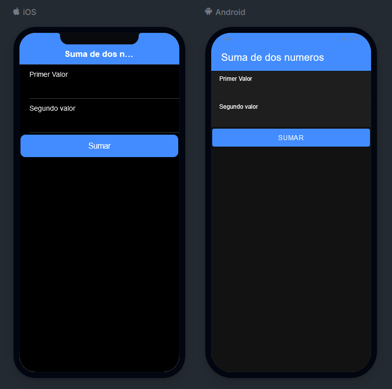
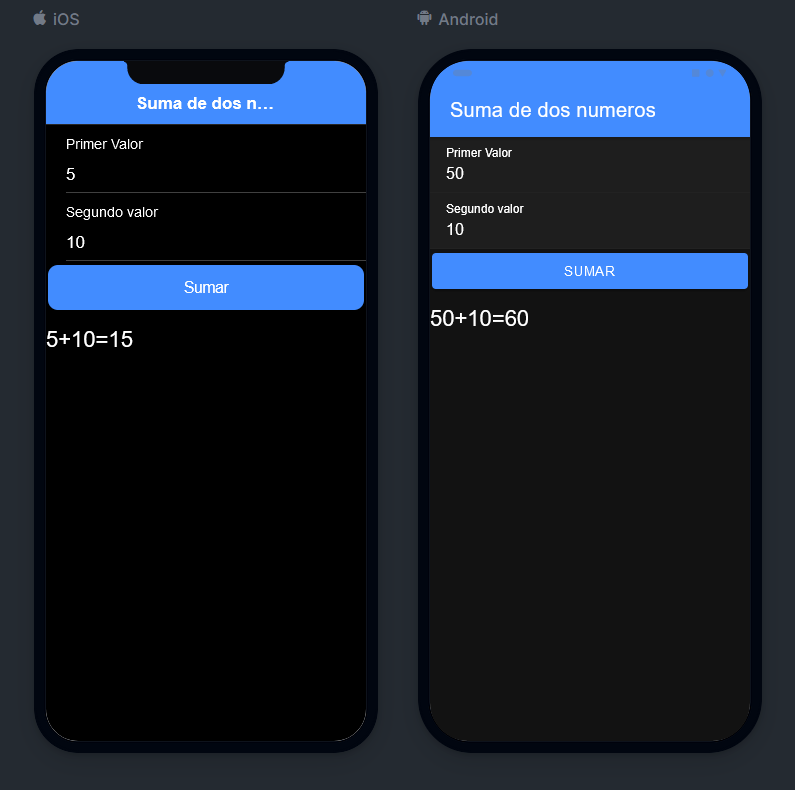

# Practica de Suma Simple de Dos Entrada en IONIC

## Marco Antonio Prado Garcia

En ese documento voy a expliar paso a paso el codigo que desarrolle con el framework para aplicaciones
móviles IONIC, utilizando el framework para frontend Angular y Typescript para las llamadas de las funciones
de JS, la practica consiste en tener don entradas en las cuales al dar clic a un bóton realice la suma de las entradas posteriores
por lo que la practica queda de la siguiente manera:

Entonces al activar dicho botón nos despliega la suma total de la siguiente manera:

Para poder utililizar este codigo es necesario que clones el repositorio desde la siguiente liga [Liga del Repositorio](https://github.com/Tonypradog/IONIC_7 "Liga del Repositorio").

Codigo del home.page.html:

``<ion-header>
<ion-toolbar color="primary">
<ion-title> Suma de dos numeros </ion-title>
</ion-toolbar>
</ion-header>

<ion-content>
  <ion-item>
    <ion-label position="stacked">Primer Valor</ion-label>
    <ion-input [(ngModel)]="valor1"></ion-input>
  </ion-item>
  <ion-item>
    <ion-label position="stacked">Segundo valor</ion-label>
    <ion-input [(ngModel)]="valor2"></ion-input>
  </ion-item>
  <ion-button expand="block" (click)="Sumar()" color="primary"
    >Sumar</ion-button
  >
  <h3>{{resultado}}</h3>
</ion-content>``
